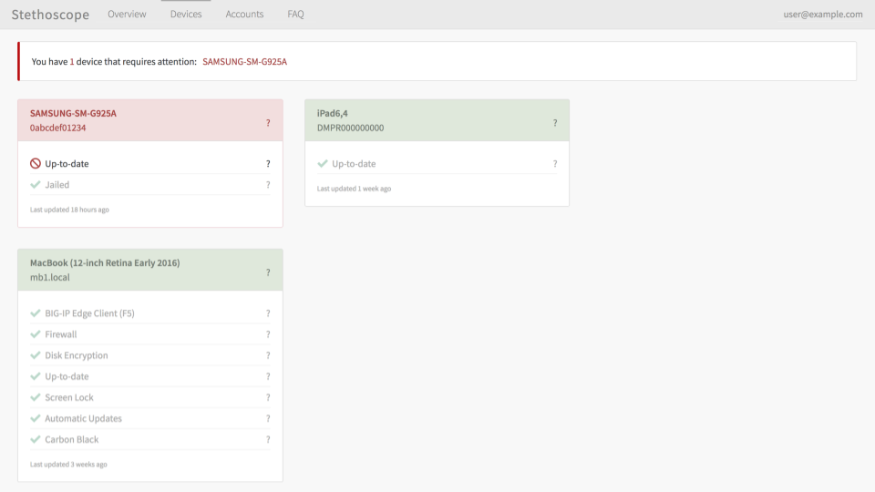

# Stethoscope: User-Focused Security


Stethoscope is a web application that collects information from existing device data sources (e.g.,
JAMF or LANDESK) on a given user’s devices and gives them clear and specific recommendations for
securing their systems. An overview is available on the [Netflix Tech
Blog](http://techblog.netflix.com/).

[](https://gitter.im/Netflix-Stethoscope/Lobby?utm_source=badge&utm_medium=badge&utm_campaign=pr-badge&utm_content=badge)
[](http://www.apache.org/licenses/LICENSE-2.0)
[]()
[](https://travis-ci.org/Netflix/stethoscope)



## Quickstart

If you have [node] (version 6.4+) and npm (included with node) installed already and just want to play around with the front end, run:

`make install-develop-ui`


## What is Stethoscope?

### Main Features

- Retrieves device information from:
  - JAMF
  - LANDESK
  - G Suite (Google) Mobile Management
  - bitFit
- Evaluates status of various security practices, including:
  - Disk encryption
  - Firewall
  - Screen saver lock/password
  - Operating system up-to-date
  - Operating system auto-update
  - Not jailbroken/rooted
  - Software presence (e.g., for monitoring tools)
- Merges associated device records
- Plugin architecture:
  - Easy to add data sources, practices, and other components
  - Examples and base plugins for communicating with Elasticsearch and HTTP REST APIs

## Getting Started

Stethoscope consists of two primary pieces: a Python-based back-end and a React-based front-end.
Nginx is used to serve static files and route traffic to the back-end.

The easiest way to get up-and-running quickly is through the provided Docker configuration.

### Docker

To run with [Docker](https://www.docker.com/), first install Docker
([standard](https://docs.docker.com/mac/) or [beta](https://beta.docker.com/)).

We have provided a [Docker Compose](https://docs.docker.com/compose/) file, `docker-compose.yml`,
that defines the services that make up Stethoscope. To start these services, run:

```sh
docker-compose up
```

Then connect to the main Nginx web server at `http://localhost:5000`.

#### Troubleshooting

If you encounter the following error, you likely need to upgrade `docker-compose` to version 1.10 or
higher.

> ERROR: In file './docker-compose.yml' service 'version' doesn't have any configuration options.
> All top level keys in your docker-compose.yml must map to a dictionary of configuration options.

### Front end

You can run (and develop) the front end code without running the backend services at all, and rely on the example data files in `stethoscope/ui/public/api`. We use Facebook's [create-react-app] scripts for easy, zero-configuration development, testing, and building.

If you would like to develop against real data, you can run the backend (locally or in Docker) and proxy API requests to the backend. This is handled automatically by [create-react-app], and you can change the proxy address in `stethoscope/ui/package.json`.

**Note:** For API authentication to work with the proxy, you'll need to generate a token that will be loaded into your development environment. If you have installed the Python dependencies, you can do this with `make dev-token`. If you have [Docker] installed, you can do this with `make dev-token-docker`.


#### Prerequisites

To run the front end directly, without Docker, you'll need recent versions of [node] (version 6.4+) and npm (included with node).

#### Installation

From the project root, run `make install-develop-ui`. This will install the npm packages, start a development server, and load the site in your default browser.

#### Running

After your node dependencies are installed, you can run the development server with `make develop-ui`. (This is equivalent to running `cd stethoscope/ui && npm start`.)

#### Configuration

The front end can be customized by adding to `stethoscope/ui/config.json`. These settings are applied after loading `stethoscope/ui/config.defaults.json`, so you can reference that file for the defaults. You can customize things like the application name, the name of your organization, and your contact email address without changing any of the javascript source files.

#### Testing

[create-react-app] includes a script that will automatically watch for changes and rerun relevant tests. You can run this with `make test-js-watch`. (This is equivalent to running `cd stethoscope/ui && npm test`.)

If you'd like to run all tests and exit, run `make test-js`.

#### Building

To build the static assets, you can run `make react-build`. (This is equivalent to running `cd stethoscope/ui && npm build`.)

This is only necessary if you want to build new static assets for a local Python backend, or if you want to check the gzipped file size of the generated js and css resources. These build files are not checked in to the project.

If you would like to build these resources without a local node development environment, you can run `make docker-build-ui` to generate the files using Docker. (This happens automatically when you run `docker-compose up`.)

## LICENSE

Copyright 2016, 2017 Netflix, Inc.

Licensed under the Apache License, Version 2.0 (the "License");
you may not use this file except in compliance with the License.
You may obtain a copy of the License at

<http://www.apache.org/licenses/LICENSE-2.0>

Unless required by applicable law or agreed to in writing, software
distributed under the License is distributed on an "AS IS" BASIS,
WITHOUT WARRANTIES OR CONDITIONS OF ANY KIND, either express or implied.
See the License for the specific language governing permissions and
limitations under the License.


[Flask]: http://flask.pocoo.org/
[FreeTDS]: http://www.freetds.org
[Homebrew]: https://brew.sh
[Klein]: https://github.com/twisted/klein
[Twisted]: https://twistedmatrix.com/
[pyenv-virtualenv]: https://github.com/yyuu/pyenv-virtualenv
[pyenv]: https://github.com/yyuu/pyenv
[tox]: https://tox.readthedocs.io/
[virtualenv]: https://virtualenv.pypa.io
[create-react-app]: https://github.com/facebookincubator/create-react-app
[Docker]: https://www.docker.com/
[node]: https://nodejs.org/
